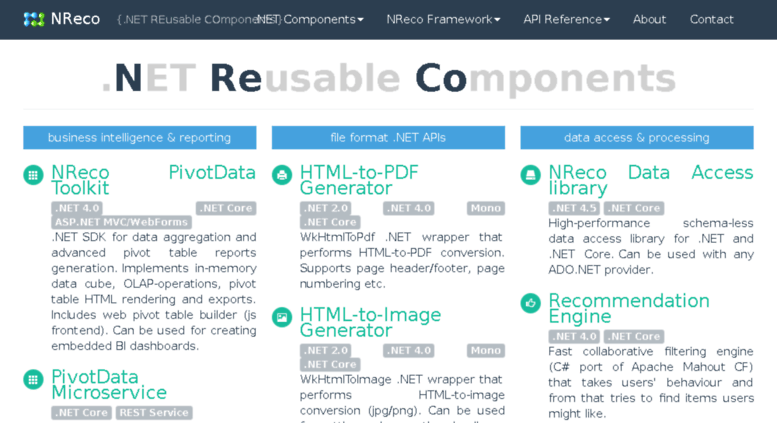

  <link type="text/css" rel="stylesheet" href="css/materialize.min.css"  media="screen,projection"/>
  <link href="http://fonts.googleapis.com/icon?family=Material+Icons" rel="stylesheet">
  <script type="text/javascript" src="https://code.jquery.com/jquery-2.1.1.min.js"></script>
  <script type="text/javascript" src="js/materialize.min.js"></script>
  <script>
    $(document).ready(function(){
      $('.collapsible').collapsible();
    });
   </script>
    
 <a href="https://eommer.github.io/EVEWebSite/" class="waves-effect waves-light btn-large">Home</a>
 <a href="https://eommer.github.io/EVEWebSite/gettingStarted.html" class="waves-effect waves-light btn-large">Getting started</a>
 <a href="doc/index.html" class="waves-effect waves-light btn-large">Documentation</a>


<div class="card">
    <div class="card-image waves-effect waves-block waves-light">
      
    </div>
    <div class="card-content">
<span class="card-title activator grey-text text-darken-4">NReco VideoConverter<i class="material-icons right"></i>More</span>
      <p>API allowing to convert or concat video using ffmpeg</p>
    </div>
    <div class="card-reveal">
      <span class="card-title grey-text text-darken-4">Card Title<i class="material-icons right">close</i></span>
<p markdown="1">

code example

```c#
	Video vid1 = new Video(@"C:/Program/name1.avi", name1, 20000);
	Video vid2 = new Video(@"C:/Program/name2.avi", name2, 10000);
	//Convert video
	VideoConverter.convertVideo(1920, 1080, 30, "h264", "ac3", vid1);
	VideoConverter.convertVideo(1920, 1080, 30, "h264", "ac3", vid2);
	//split video
	Video vid1Part1 = VideoConverter.splitVideo(vid1, 1, "00", "00", "00", "00", "00", "18");
	//concatenate videos
	Video vid3 = VideoConverter.concatTwoVideos(vid1, vid2);
```

</p>
    </div>
 </div>
  
  
<div class="row">
        <div class="col s12 m7">
          <div class="card small">
            <div class="card-image">
              
              <span class="card-title">NReco VideoConverter</span>
            </div>
<div class="card-content">
<span class="card-title activator grey-text text-darken-4">NReco VideoConverter<i class="material-icons right"></i>More</span>
      <p>API allowing to convert or concat video using ffmpeg</p>
    </div>
    <div class="card-reveal">
      <span class="card-title grey-text text-darken-4">Card Title<i class="material-icons right">close</i></span>
<p markdown="1">

	API used to convert and concat videos using ffmpeg

	```c#
		Video vid1 = new Video(@"C:/Program/name1.avi", name1, 20000);
		Video vid2 = new Video(@"C:/Program/name2.avi", name2, 10000);
		//Convert video
		VideoConverter.convertVideo(1920, 1080, 30, "h264", "ac3", vid1);
		VideoConverter.convertVideo(1920, 1080, 30, "h264", "ac3", vid2);
		//split video
		Video vid1Part1 = VideoConverter.splitVideo(vid1, 1, "00", "00", "00", "00", "00", "18");
		//concatenate videos
		Video vid3 = VideoConverter.concatTwoVideos(vid1, vid2);
	```

</p>
    </div>
            <div class="card-action">
              <a href="https://www.nrecosite.com/video_converter_net.aspx">Go to the site</a>
            </div>
          </div>
        </div>
</div>
      
<div class="row">
        <div class="col s12 m7">
          <div class="card">
            <div class="card-image">
              
              <span class="card-title">NReco VideoInformation</span>
            </div>
            <div class="card-content">
              <p>API allowing to get informations about videos</p>
            </div>
            <div class="card-action">
              <a href="https://www.nrecosite.com/video_info_net.aspx">Go to the site</a>
            </div>
          </div>
        </div>
</div>
        
